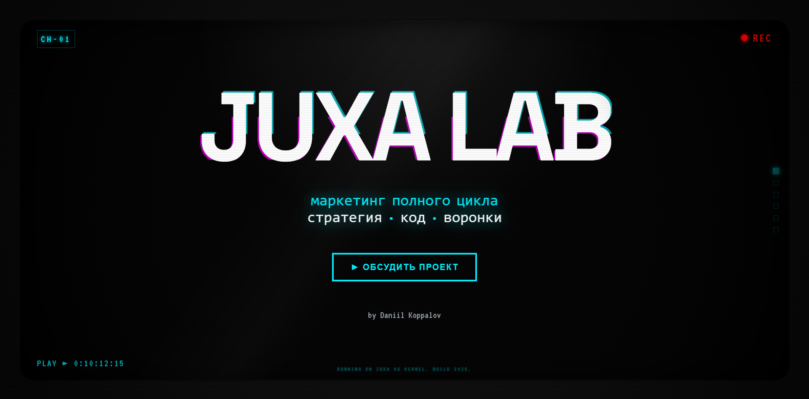

# 📼 JUXA OS | Cyberpunk Portfolio

> "Wake the f*ck up, Marketer. We have a funnel to burn."



## ⚡ О проекте

Я не фронтенд-разработчик. Я маркетолог, который устал от шаблонных лендингов на Тильде. Этот проект — доказательство того, что в 2025 году барьер между "идеей" и "реализацией" сломан. Весь код написан в соавторстве с нейросетями (Google Gemini & ChatGPT), а я выступил в роли архитектора и промпт-инженера.

### 🎯 Фичи
*   **VHS & Glitch эстетика:** Шум, скан-линии, хроматические аберрации.
*   **Terminal Mode:** Полностью рабочий эмулятор терминала. Попробуйте ввести `help`.
*   **TV Frame:** Стилизация под старый ЭЛТ-монитор.
*   **Infinite Loop:** Бесконечная прокрутка слайдов ("каналов").
*   **Пасхалки:** Да, они тут есть.

## 🛠 Технический стек

Да, для маркетолога это overkill, но кого это волнует?

*   **Core:** React + TypeScript + Vite
*   **Styling:** Tailwind CSS (via PostCSS)
*   **Animations:** Framer Motion
*   **Deployment:** Vercel
*   **AI Assistance:** Google AI Studio (Gemini 3.0), ChatGPT-5.1

## 🚀 Запуск локально

Если вы хотите поковырять код или запустить свою версию Cyberpunk-портфолио:

1.  **Клонируйте репозиторий:**
    ```
    git clone https://github.com/your-username/juxalab.git
    ```

2.  **Установите зависимости:**
    ```
    npm install
    ```

3.  **Запустите dev-сервер:**
    ```
    npm run dev
    ```

4.  **Build for production:**
    ```
    npm run build
    ```

## 🤖 Как это было сделано?

Я не написал ни строчки кода "из головы". Весь процесс — это диалог с AI.
Подробную историю создания (с болью, криками и восторгoм) читайте в моей статье:
[Ссылка на статью на VC/Habr]

## 📄 Лицензия

Этот проект открыт для всех. Хотите сделать такой же? Форкайте на здоровье.
Код распространяется под лицензией MIT.

---

<div align="center">

**JUXA LAB**
*Marketing · Strategy · Code*

[Live Demo](https://www.juxalab.ru/)

</div>
